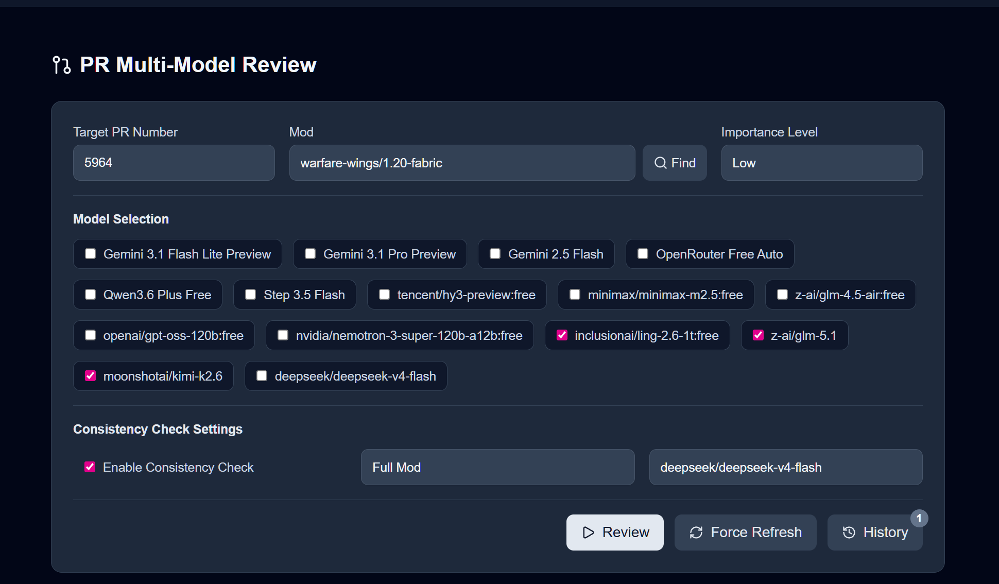
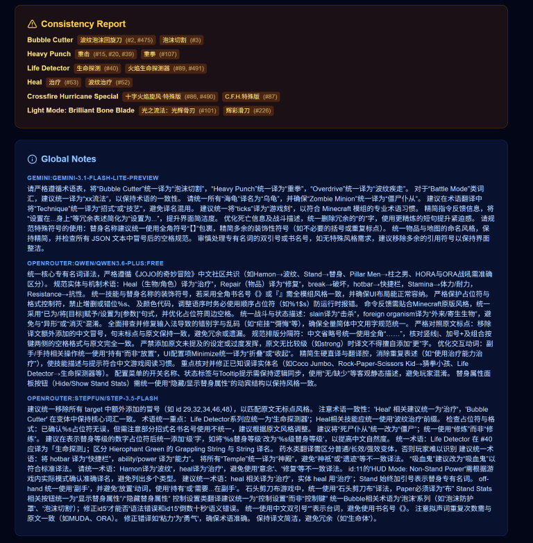
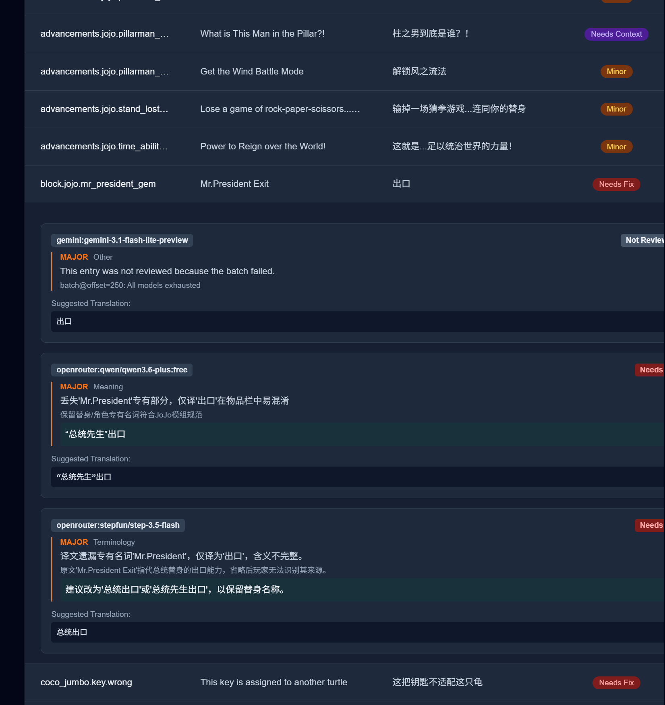

<!-- markdownlint-disable -->

我想说的是：  
Minecraft Mod 的本地化和其他场景截然不同：
- Mod 自己有很多分支 特别点名 GT
- 单 Mod 可以有很多附属 Mod
- 单 Mod 内可以有手册等数量极大，但标准不统一的需要本地化内容
- 单 Mod 可以有好几个 对应 Minecraft 的版本 这就导致：
  - 1.18 和 1.19 内容可能完全一样 也可能有细微差距
  - 1.12 和 1.16+ 差距很大

一点一点说：

- 上面的三个问题中，CFPA 做了个组合文件功能（理解成文件引用文件），但组合文件又没有 GUI 工具不好写
- 附属 Mod 问题：上下文怎么引用？怎么保证附属 Mod 和主 Mod 术语统一？然后我们就想做术语库，但推进缓慢
- 手册问题：看到你最上面说了 AI，有的模组单文件都 > 160k token，不太好解决上下文统一和降智

但可能还是往太完美的方向思考了，可能放一个中间点就行

---

然后回到你的问题，首先介绍一下我自己，我是 Cyl18，写CFPABot的

> 1.我了解到 CFPA 曾使用 Weblate接收翻译贡献并审校，后来转向基于GitHub PR的工作流。请问当时决定转向的主要原因是什么?

我自己不太清楚 Weblate之前的状态，这个得问其他人；  
不过 GitHub PR 的工作流痛点极大，我曾经问过某个模型:

问题的本质不是“审得慢”，而是协作拓扑错误

你现在的拓扑是：

汉化者 → PR → 少量审阅者 → 官库 → 分发

这个模型的问题有三个不可修补的缺陷：

- 强串行化: PR 必须经过固定节点（审阅者），等同于单通道事务队列，300 个积压是必然结果。
- 高认知门槛前置: git / GitHub / PR / review / rebase / conflict，这些被强行施加给“文本贡献者”，这在协作理论上是反模式。
- 语义协作与源码协作混用: 语言翻译是“可模糊协商、可并行演化”的，而 Git PR 是“精确、强一致”的工具，天然冲突。

继续围绕 GitHub 改良，只会更复杂，不会更顺。

你要的是：面向语言资源的协作系统 + 自动化的质量闸门 + 机器可验证的发布流水线

把职责拆开，会清晰很多：

Git：只负责最终产物、版本化、可审计  
协作平台：负责人参与、讨论、修改、投票  
自动化：负责一致性、格式、回归检查  
分发系统：负责高并发、增量、版本差异

你现在把这四件事捆在了一起。

现在你是：
文件 → Git diff → 审核

建议改成：  
语义条目（key） → 多版本值 → 状态机

> 2.目前围绕 GitHub进行的贡献提交、资产维护、打包和分发这一整套流程,有哪些让你们比较头疼的地方?

我把prompt给你：

我们做了一个Minecraft Mod中文汉化项目，处理几千个mod的作者已经不维护或翻译更新慢等问题，以mod自动下载进行分发，此mod为全版本通用，通过在预启动阶段进行下载资源包和修改options.txt实现，以前的机制是weblate合作，但激励性不好，并且出现了一些决策失误。目前的模式是汉化者提交并签署CLA，审阅者审核并提出意见修改，最后合并进官库分发。这样带来了诸多问题：
- 审阅难，因为审阅者只有几位，又要保证质量，造成PR积压，目前有三百个
- 如果作者不回复，最后不得不close
- 难协作，只有提交者或多个提交者和审阅者参与
- GitHub 的模式很不适合新人参与，git使用难，git审核语言文件也难
- 有时候含糊不清，难以投票和公示

另外：
- 目前的模式是打包整个仓库并使用zip无法固实压缩导致高峰时期下载慢
- 不同minecraft版本之间可能有相同也有不同模组
- 仓库结构采取mod分发站id来分离mod，但有的mod有fork，因为mod没有修改domain，导致合并所有文件后都合并了  
我们还设计了一套机制，用定义好的json格式来生成语言文件，解决类似多种颜色多种物品同时组合在一起的问题，同时可以引用别的文件  
审核难，提交难，分发难

> 3.官方仓库 PR下有一个Bot在做自动上下文收集和程序化的质量验证,它对审校工作的实际帮助有多大?

我是做 CFPABot 的，对实际用的情况了解不大；但之前 Bot 死了半年，我没维护，导致审核底线下跌和更多的麻烦；

在我看来最重要的两个功能是：

- 校验提交者提交的路径是不是有问题：这是 Git 的痛点
- Diff：\[Base-En/Head-En] => \[Base-Cn/Head-Cn]，因为 Git 自带的 Diff 对这种语言文件的 Diff 很不友好，也看不到源英文

---

写到这里，我感觉

汉化者 → PR → 少量审阅者 → 官库 → 分发

这个模式确实有点问题，不过我也想不到什么方法

很重要的一点还是动机：你不可能让少数人去汉化自己不喜欢的 Mod？很多情况下是看到自己喜欢的 Mod 没汉化然后来做的？

---

> 4.如果这个Bot具备AI能力,能对每个PR进行抽象质量评估并给出修改建议(类似GitHub Copilot 的PR Reviewer 功能)，你觉得它会对审校有明显帮助吗?为这种能力付费的话，你觉得合理方式（单次付费/订阅）和范围是多少?  
> 5.团队是否考虑或实践过对部分符合条件的PR进行AI审校和合并?效果如何呢?

实际上我做了三次 LLM 审核，每次做的都比上一次更好；不过一个月前做的版本，还是鸽了

使用LLM，我感觉对一些小的格式疏漏或者统一性会很好，不过大判断还是交给人；  
想的方案是多模型 Fusion 给答案，但我自己想做的太完美就做不下去了  
小模型太傻，大模型太贵  

价格？BYOK 和公益站

你可以看看现在我这的效果，我的架构是 structure json，但可能 agent+tool call 会好点：

我其实觉得勉强能用 但是我还有好多没做完  
比如把条目提交到GitHub  
忽略特定模型的输出  
还有上下文检查  
不过看个大概（语法，通顺）还可以 以及UI还得优化一下

>6.目前社区在工具方面最大的痛点是什么?

我自己觉得审核和翻译应该在同一个平台上

> 7.社区内部有哪些常用的自制工具?它们分别解决什么问题?

CFPA 群里有个：  
我的世界模组整合包汉化工具.exe

以及你可以加群来问问前沿汉化者

> 8.仓库中包含部分模组的源语言文件（例如en_us.json）,这是出于技术必要性吗?这种模式是否带来过法律或合规方面的隐患?

是技术必要性，但可以不丢仓库里或者另外写 LICENSE，详情可以问问 mamarou

> 9.模组作者硬编码文本的情况常见吗?社区遇到硬编码时通常会怎么做?  
> 10.社区目前是否有技术手段，能在作者未提供国际化支持(无外置语言文件)的情况下,依然将翻译应用到游戏中?这种手段稳定吗?

vm 汉化组

> 11.CFPA官网上的术语库是如何维护的?底层用了哪些检索技术?比如向量检索、trgm、BM25 或者rerank模型之类。

@502y  
目前502y和团队内做了个AI爬的和人工整理的两套数据库，问问

> 12.社区是否专门维护了翻译记忆查询工具，供贡献者和审校人员使用?

没有

> 13.当一个模组发布新版本，增加了key 或修改了原文，CFPA是通过什么机制发现这些变化的?是贡献者手动认领，还是有脚本爬取和更新?

目前没有，大概是翻译者看到有东西没翻译然后来加；

另外 CFPABot 有一个自动找最新 en_us 和仓库内对不对应的功能，但不太准

---

另外其实 agent 比 纯 JSON 输出好点？或者两者都要？

我还想做自动从模组源代码仓库拉某个项对应的上下文的 tool call 的，但，咕咕

---

我自己的性格是心情好就做点事，比如 CFPABot 这边 我可能三天疯狂写然后不管半年，我自己跟 CFPA 可能没有联系那么紧密，当时只是觉得写个项目好玩而已

有的时候太追求完美导致还没开始做就放弃了（

---

群里：

> 你有没有想过这东西可以直接用 codex 加提示词就能做  
> 我记得没错的话 codex 有 GitHub app 的  
> codex 有 code review 的吧

---

🐖
